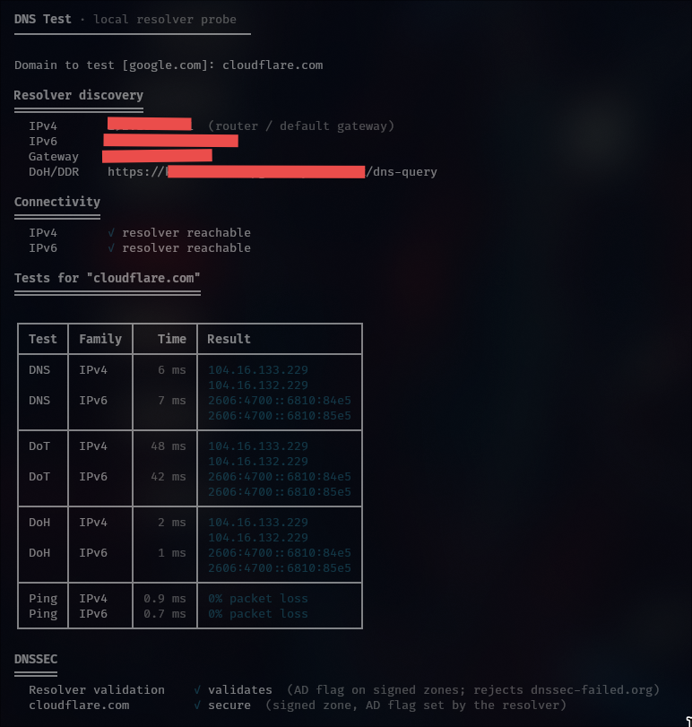

# DNS Test Script

Probe the DNS resolver your network hands you — typically your router — over
**plain DNS**, **DNS-over-TLS (DoT)** and **DNS-over-HTTPS (DoH)**, on both
**IPv4** and **IPv6**, check **DNSSEC**, then **ping** the target domain.

The resolver is auto-discovered from the system (`/etc/resolv.conf` first, then
NetworkManager / systemd-resolved / `scutil`, then the default gateway) — no
public DNS servers are hard-coded; everything is tested against *your* network.
If the resolver advertises encrypted endpoints via DDR (RFC 9462/9463, the
`_dns.resolver.arpa` SVCB record), those are used for the DoH test.

The DNSSEC section reports two things: whether the resolver **validates**
(it should set the `AD` flag on a known-signed zone and reject the deliberately
broken `dnssec-failed.org`), and the DNSSEC status of the **target domain**
(`secure` / `signed` / `not signed` / `BOGUS` / `blocked`, using the `AD` flag,
`RRSIG` records, `SERVFAIL`+`CD` and any Extended DNS Error returned).



## Requirements

* Linux or macOS (should also work on Windows under WSL — *not tested*).
* `dig` — from `bind` / `bind-utils` / `dnsutils`.
  **DoT and DoH require `dig` ≥ 9.18**; with an older `dig` those two tests are
  skipped and the rest still run.
* `ping` (and `ping -6` / `ping6`) — from `iputils` on Linux, built in on macOS.

### Installing dependencies

**Debian/Ubuntu:**
```bash
sudo apt-get update
sudo apt-get install -y dnsutils iputils-ping
```

**Arch:**
```bash
sudo pacman -S --needed bind iputils
```

**macOS (Homebrew, for an up-to-date `dig`):**
```bash
brew install bind
```

More info on [WSL](https://learn.microsoft.com/en-us/windows/wsl/install).

## Usage

```bash
git clone https://github.com/w1tw0lf/DNS_test.git
cd DNS_test/
./dns_test.sh                 # prompts for the domain (defaults to google.com)
./dns_test.sh example.com     # or pass it on the command line
NO_COLOR=1 ./dns_test.sh ...  # disable coloured output
```

## Notes

* Most home routers answer plain DNS but not DoT/DoH — a `not offered` result
  for those rows is normal and simply tells you the router doesn't run an
  encrypted resolver on `:853` / `:443`.
* `REFUSED` on a lookup means the resolver declined the query (e.g. a reserved
  TLD like `.example`, or split-horizon policy), not that the transport failed.
* The DNSSEC validation check queries the external test domains
  `dnssec-failed.org` (intentionally broken) and a known-signed control domain
  through your resolver — those two lookups are how the test works.
* On older macOS, `dig` issues are usually fixed by updating `bind`:
  `brew install bind`.
