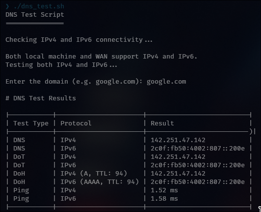

# DNS Test Script

This script checks for IPv4 and IPv6 connectivity and then performs DNS, DoT, DoH, and ping tests for a specified domain.



## Requirements:

*   Currently supports Linux and macOS. It should run on Windows in WSL (*not tested*).
*   The following command-line tools must be installed:
    *   `dig` (part of `dnsutils` or `bind-utils`)
    *   `ping` and `ping -6` (part of `iputils-ping` or similar)
    *   `curl`
    *   `jq`
    *   `bc`

### Installing Dependencies:

**For Debian/Ubuntu based systems:**
```bash
sudo apt-get update
sudo apt-get install -y dnsutils iputils-ping curl jq bc
```

**For Arch based systems:**
```bash
sudo pacman -Syu
sudo pacman -S --noconfirm dnsutils inetutils curl jq bc
```

**For macOS (using Homebrew):**
```bash
brew install bind curl jq
```

More info on [WSL](https://learn.microsoft.com/en-us/windows/wsl/install).

### To run locally:
```bash
git clone https://github.com/w1tw0lf/DNS_test.git
cd DNS_test/
./dns_test.sh
```

### Possible issues:

1.  On older macOS, you might find that it gives an issue with the `dig` command. The fix is to update `bind` via brew with ```brew install bind```.
